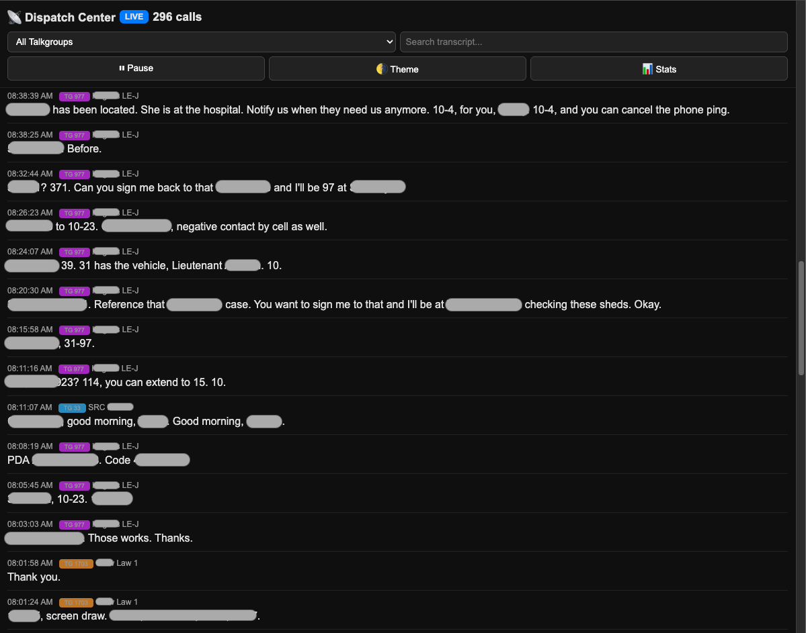

# Trunk Recorder AI Dashboard


A lightweight **real-time dashboard and transcription interface for Trunk Recorder systems**, powered by PostgreSQL, Meilisearch, and AI transcription services.

This project provides a clean, fast web interface for monitoring live radio traffic captured by **Trunk Recorder**. Calls are automatically indexed, transcribed, and presented in a searchable dashboard with real-time updates.

---

# Dashboard Preview



The dashboard provides real-time visibility into trunked radio activity, displaying call metadata and AI-generated transcriptions within seconds of call completion.

---

# Overview

Many Trunk Recorder installations record thousands of calls per day but lack an intuitive way to monitor or search those calls locally.

This project provides:

• A **real-time web dashboard** for monitoring active radio calls
• **Automatic AI transcription** of voice traffic
• **Searchable call history** powered by Meilisearch
• **Low-resource Docker deployment**
• Compatibility with **OpenMHz and Broadcastify workflows**

The system runs entirely inside Docker containers and connects directly to the recordings generated by Trunk Recorder.

---

# Architecture

```
RTL-SDR Devices
     │
     ▼
Trunk Recorder
     │
     ▼
Recorded Calls Directory
(/opt/trunk-recorder/station_name)
     │
     ▼
Watcher Service
     │
     ├── PostgreSQL (metadata storage)
     ├── Meilisearch (search indexing)
     └── AI Transcription Worker
            │
            ▼
        DeepInfra API
            │
            ▼
        Transcript
            │
            ▼
     WebSocket Server
            │
            ▼
     Real-Time Dashboard
```

---

# Key Features

## Real-Time Call Dashboard

Displays calls as they occur with live updates through WebSocket connections.

Features include:

• Call timestamp
• Talkgroup ID and name
• Call duration
• AI transcription text

Calls typically appear in the interface within seconds after completion.

---

## Talkgroup Filtering

Users can filter calls by talkgroup using the dropdown selector.

Example:

```
978 – City Law Enforcement
1579 – County Dispatch
1704 – Fire Operations
```

This allows operators to monitor specific agencies without noise from unrelated traffic.

---

## AI Voice Transcription

Calls are automatically transcribed using AI speech recognition.

```
Call recorded
   │
   ▼
Watcher detects audio file
   │
   ▼
Audio sent to DeepInfra
   │
   ▼
Transcript returned
   │
   ▼
Stored in PostgreSQL
   │
   ▼
Indexed in Meilisearch
   │
   ▼
Displayed in dashboard
```

Transcriptions typically appear **within seconds** after a call ends.

---

## Searchable Call History

All calls are indexed in **Meilisearch**, allowing instant search across:

• talkgroups
• transcript text
• timestamps

Example searches:

```
"traffic stop"
"structure fire"
"medical"
```

---

# System Requirements

Recommended minimum:

| Component         | Requirement   |
| ----------------- | ------------- |
| CPU               | 2 cores       |
| RAM               | 2–4 GB        |
| Storage           | 10–20 GB free |
| OS                | Linux         |
| Container Runtime | Docker        |

---

# Example Directory Layout

Typical installation layout:

```
/opt
 ├── trunk-recorder
 │     ├── config.json
 │     ├── talkgroups.csv
 │     └── station_name/
```

Recorded calls follow this structure:

```
/opt/trunk-recorder/station_name/YYYY/M/D/
```

Example:

```
/opt/trunk-recorder/station_name/2026/2/21/
```

Each call generates:

```
call.wav
call.m4a
call.json
```

---

# Quick Start

### 1. Clone the Repository

```
git clone https://github.com/YOUR_USER/trunk-recorder-ai-dashboard
cd trunk-recorder-ai-dashboard
```

---

### 2. Create Environment Variables

Copy the example environment file.

```
cp .env.example .env
```

Edit `.env` and configure:

```
POSTGRES_PASSWORD=changeme
MEILI_MASTER_KEY=changeme
DEEPINFRA_API_KEY=your_api_key_here
```

---

### 3. Configure Docker Compose

Navigate to the stack directory.

```
cd stack
```

Copy the example compose file.

```
cp docker-compose.example.yml docker-compose.yml
```

Edit the recordings path if needed:

```
volumes:
  - /opt/trunk-recorder/station_name:/recordings
```

---

### 4. Start the Stack

```
docker compose up -d --build
```

This starts:

• Watcher service
• PostgreSQL database
• Meilisearch search engine
• Dashboard web interface

---

### 5. Open the Dashboard

```
http://YOUR_SERVER_IP:8080
```

The dashboard will populate automatically as calls are recorded.

---

# Automatic Recording Cleanup

Trunk Recorder systems can generate thousands of recordings per day.
A cleanup script is included to prevent disk usage from growing indefinitely.

Script location:

```
scripts/trunk-cleanup.sh
```

Make the script executable:

```
chmod +x scripts/trunk-cleanup.sh
```

Add a cron job:

```
crontab -e
```

Example:

```
15 * * * * /path/to/repository/scripts/trunk-cleanup.sh
```

Example path:

```
15 * * * * /opt/trunk-recorder-ai-dashboard/scripts/trunk-cleanup.sh
```

Default retention: **12 hours**

---

# Troubleshooting

### Verify recordings exist

```
ls /opt/trunk-recorder/station_name
```

### Verify recordings inside the container

```
docker exec -it trunk-watcher ls /recordings
```

If the directory is empty inside the container, verify the volume mapping in `docker-compose.yml`.

---

# Project Goals

• A **clean monitoring interface** for trunked radio systems
• **Real-time visibility into radio activity**
• **Searchable voice transcripts**
• **Simple Docker deployment**

Useful for:

• radio hobbyists
• emergency communications monitoring
• radio traffic analysis
• homelab environments

---

# Future Improvements

• audio playback in dashboard
• multi-system support
• advanced search filters
• map integration
• call alerting
• priority talkgroup highlighting

---

# Disclaimer

This project is intended for **legal monitoring of publicly accessible radio communications**.

Users are responsible for complying with all local laws regarding radio monitoring and recording.

---

# License

Released under the **MIT License**.

---

# Acknowledgements

Thanks to the developers of:

• Trunk Recorder
• the radio monitoring community

Their work makes modern trunked radio monitoring possible.
